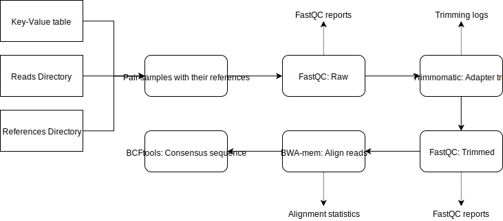
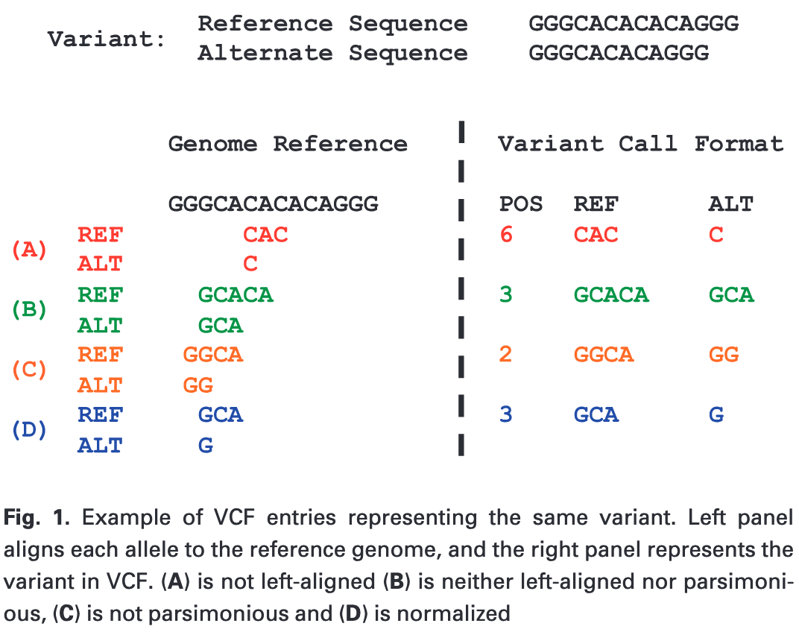

# Gene Capture Assembly Pipeline

This is a simple pipeline that aligns gene capture data to a transcriptome reference file (Trinity), generating a consensus 'gene sequence' at the other end.



## Installing the pipeline

To install the pipeline, log into Phoenix and run the following

`$ git clone https://github.com/a-lud/gene_capture.git`

This will download this repository into the directory where you execute this code. I recommend making a `tools` directory or something similar in your fast directory on Phoenix.

## Requirements

This pipeline requires Python and a few of its libraries. I've included an example of how to install this pipeline in a contained environment below with all required software.

Run the following on the head node of Phoenix.

```
$ module load Anaconda3/5.0.1
$ conda create -n geneCapture_env argparse pandas mosdepth trimmomatic bwa fastqc samtools bcftools

## Can activate the environment using the command below
$ conda activate geneCapture_env
```

If all the software installs correctly, you should be met with a message demonstrating how to activate the conda environment. See the section `Running the pipeline on Phoenix` below to see how to run the pipeline.

**NOTE**: MosDepth is only available on Linux systems! It will not install on Mac.

## The pipeline: getConsensus.py

The pipeline has the script `getConsensus.py` which is the main script. There is also an accessory script `bwa_align.sh` which is called within the `getConsensus.py`, meaning you don't need to worry about it.

The script `getConsensus.py` has the following arguments:

**Key-value file (-kv)**: This is a two columned CSV file that has the columns `sample` and `reference`. For each sample, match it to a **unique** basename of the reference it belongs to. Do not provide the file extension.
    -kv /path/to/key_value.csv

**Reads file directory (-rd)**: A directory path to where the gene capture reads are located.
  
- -rd /path/to/reads_dir

**Reference file directory (-fd)**: A directory path to where the transcriptomic (or any reference) files are located.
  
- -fd /path/to/references_dir

**Output directory (-o)**: Provide the directory path to where you'd like the output of the pipeline to be stored.
  
- -o /path/to/output_dir

**Adapter file (-af)**: Provide the file path to a fasta file containing the adapter sequences used for your sequencing. If you do not have them, I've included a comprehensive adapter file as part of this repo.

- -af /path/to/adapters.fa

**Threads**: If you have a multi-threaded machine, provide the number of threads you'd like to use in multi-threaded processes (e.g. FastQC, Trimmomatic and BWA)

- -j 8

Below is the full help page

```
$ ./getConsensus.py -h
usage: getConsensus.py [-h] -kv KEYVALUEPATH -rd READSDIR [-fd REFDIR] -o
                       OUTPUTDIR -af ADAPTERFILE [-j THREADS]

Pipeline to assemble gene capture data using closely related references

optional arguments:
  -h, --help            show this help message and exit
  -kv KEYVALUEPATH, --keyValuePath KEYVALUEPATH
                        File path to key-value table
  -rd READSDIR, --readsDir READSDIR
                        Directory path to gene capture data
  -fd REFDIR, --refDir REFDIR
                        Directory path to reference fasta files
  -o OUTPUTDIR, --outputDir OUTPUTDIR
                        Directory path for output location
  -af ADAPTERFILE, --adapterFile ADAPTERFILE
                        File path to adapter sequence file for Trimmomatic
  -j THREADS, --threads THREADS
                        Number of threads for different tasks (default: 2)

Developed: Alastair Ludington
Institution: University of Adelaide
Date: 11/10/2019
```

## Running the pipeline on Phoenix

Once you've created your conda environment with all the required software, you need to create a `SLURM` submission script to run the pipeline. I've generated a mock template below of what needs to be in the script.

```
#!/bin/bash
#SBATCH --job-name=gene_capture
#SBATCH -p batch
#SBATCH -N 1
#SBATCH -n 1
#SBATCH -c 8
#SBATCH --time=8:00:00
#SBATCH --mem=16GB
#SBATCH -o /home/a123456/fastdir/path/to/geneCapture_slurm/%x_%j.out
#SBATCH -e /home/a123456/fastdir/path/to/geneCapture_slurm/%x_%j.err
#SBATCH --mail-type=END
#SBATCH --mail-type=FAIL
#SBATCH --mail-user=firstName.lastName@adelaide.edu.au

## Load modules
module load Anaconda3/5.0.1

PIPELINE=/path/to/gene_capture/pipeline
READS=/path/to/reads
REFERENCES=/path/to/references
OUTDIR=/path/to/output_dir

conda activate geneCapture_env

## Running the pipeline
${PIPELINE}/getConsensus.py \
-kv /path/to/keyValue.csv \
-rd ${READS} \
-fd ${REFRENCES} \
-o ${OUTDIR} \
-af /path/to/adapters.fa \
-j ${SLURM_CPUS_PER_TASK}

conda deactivate
```

Copy the above contents into a file called `geneCapture_submission.sh`, or something similar.

This would then be executed from Phoenix's head node using the command `$ sbatch geneCapture_submission.sh`, which
would submit the job to the Phoenix execution queue.

## Pipeline methods

Below is an outline of the processes in the pipeline.

#### Trimming

Reads are trimmed before alignment using the Trimmomatic software. The software is run with the following parameters.

Sliding window trimming (`SLIDINGWINDOW`) is performed with a window size of 4bp. From the 5' end of the read, the software clips reads if the windows average quality drops below a quality threshold. Here, the quality threshold is set ot 5.

Bases at the begnning and ends of reads are also trimmed if they fall below a quality threshold (`LEADING:5` and `TRAILING:5`).

Finally, reads are filtered if their length falls below a minimum length of 25bp (`MINLEN:25`).

#### Alignment to reference

Alignment is carreied out by the software `BWA mem`. The gap penalty was changed from 4 to 2 (`-B 2`), while short, split hits were marked as secondary (`-M`). Alignment files were then sorted and filtered for unmapped reads (`flagsts = 4`) using `SAMtools`.

#### Genotype and SNP calling

Consensus sequences were called using `BCFtools`. Genotype likelihoods were generated from the aligned sequence data using `bcftools mpileup` with parameters; max depth = 5000bp, MapQ >= 20 and BaseQ >= 20.

Genotype calls were converted to variant calls using `bcftools call`, which uses the genotype likelihood information to make definitive variant calls at each position.

Variant calls were then normalized using `bcftools norm`. Variant normalisation invloves the process of making variants parsimonious and left-aligned. Parsimony in variant calling is representing a variant in as few nucleotides as possible without reducing the length of the variant to zero base pairs. Left-alignment of a SNP is when the starting position of a variant is shifted continually left until it no longer makes sense to do so.

The figure below demonstrates the process of normalisation on a tandem repeat deletion. Each colour represents a different approach to reporting the same variant.



SNPs and indels were also merged into a single record using the parameter `+any` during the normalisation process. This is done to collapse overallping SNPs and indels to prevent coordinates shifting when calling the consensus sequence.

#### Consensus calling

Consensus sequences are finally called using `bcftools consensus` with the parameter `-H 1` which uses the first allele from the `FORMAT/GT` field in the VCF file.